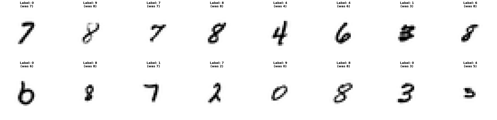
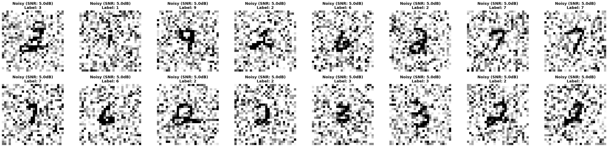
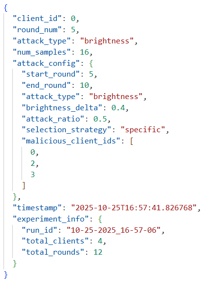
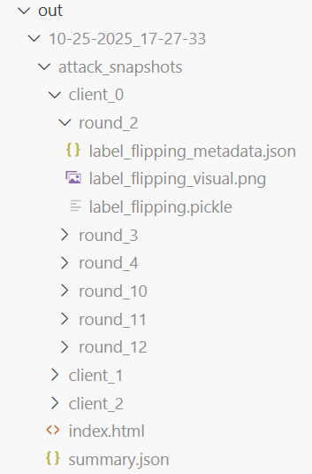

# ⚔️ Attack Scheduling System

**Round-based attack scheduling with support for stacking multiple attack types.**

## Table of Contents

- [Quick Start](#-quick-start)
- [Overview](#-overview)
- [Quick Reference](#-quick-reference)
- [Attack Stacking](#-attack-stacking)
- [How Poisoning Works](#️-how-poisoning-works)
- [Client Selection Strategies](#-client-selection-strategies)
- [When to Use](#-when-to-use)
- [Expected Validation Messages](#-expected-validation-messages)
- [Attack Types](#-attack-types)
- [Attack Snapshot System](#-attack-snapshot-system)
- [Programmatic Analysis](#-programmatic-analysis)
- [Example Configurations](#-example-configurations)
- [Viewing Results](#-viewing-results)
- [Configuration Schema](#-configuration-schema)
- [Troubleshooting](#-troubleshooting)
- [Implementation Details](#-implementation-details)

---

## ⚡ Quick Start

### Simple Configuration

Add `attack_schedule` to your strategy config:

```json
{
  "aggregation_strategy_keyword": "krum",
  "num_of_rounds": 12,
  "num_of_clients": 10,
  "dataset_keyword": "femnist_iid",
  "attack_schedule": [
    {
      "start_round": 3,
      "end_round": 8,
      "attack_type": "label_flipping",
      "flip_fraction": 0.7,
      "selection_strategy": "specific",
      "malicious_client_ids": [0, 1, 2]
    }
  ]
}
```

### Running

```bash
python -m src.simulation_runner your_config.json
```

> Note: Runnable preset configuration examples can be found in `config/simulation_strategies/examples`  
> E.g., `python -m src.simulation_runner examples/attack_visualization_config.json`

---

## 🎯 Overview

Control when and which clients are poisoned during training:

- **Round-based scheduling** - Attacks trigger during specific rounds
- **Client targeting** - Specific clients, random selection, or percentage
- **Attack stacking** - Multiple attack types can overlap and stack
- **Data inspection** - Optional snapshot system for attack analysis (set `save_attack_snapshots: true`)
- **Clean transitions** - Clients train normally → attack → resume training

**Example:**

```text
Rounds 1-2:   Normal training ✅
Rounds 3-8:   Clients 0,1,2 flip 70% labels ⚠️
Rounds 5-10:  Clients 0,1 add gaussian noise ⚠️
              (Rounds 5-8: Both attacks stack! 🔴)
Rounds 9-10:  Only gaussian noise on clients 0,1 ⚠️
Rounds 11-12: Normal training ✅
```

---

## 📸 Visual Snapshot Feature

Inspect poisoned data directly.

### Example: Label Flipping Attack Visualization


> Shows 5 FEMNIST handwritten digits with labels changed by label flipping attack. Each image shows "Label: X (was Y)" to visualize the poisoning effect.

### Example: Gaussian Noise Attack Visualization


> Shows images with added gaussian noise. Titles display SNR level and attack ratio used.

### Example: Brightness Attack Visualization


> Shows images with brightness adjustments. Titles display brightness delta value used.

### Example: Snapshot Metadata (JSON)


> Human-readable attack details showing client ID, round number, attack type, and full configuration parameters.

### Example: Snapshot Directory Structure


> Shows the hierarchical organization: `client_X/round_Y/` with three file types per attack: `.pickle` (full data), `_visual.png` (image preview), and `_metadata.json` (attack config).

**Recommended config for screenshots**: Use `examples/attack_visualization_config.json` - it's optimized for visual demonstration with:

- Only 12 rounds (fast execution)
- Multiple attack types (label flipping, noise, brightness)
- Separated attack windows (no overlaps for clear examples)
- Dramatic attack parameters (SNR 5.0dB, brightness 0.6, flip 0.8)
- `attack_snapshot_format: "pickle_and_visual"` for all file types
- Small dataset subset for quick testing

---

## 📋 Quick Reference

| Feature | Config Key | Values | Notes |
|---------|-----------|--------|-------|
| **Attack scheduling** | `attack_schedule` | List of attack configs | Required |
| **Save snapshots** | `save_attack_snapshots` | `"true"` / `"false"` | Optional: saves samples per attack |
| **Snapshot format** | `attack_snapshot_format` | `"pickle"`, `"visual"`, `"pickle_and_visual"` | Default: `"pickle"`. Use `"pickle_and_visual"` for PNG + pickle + JSON |
| **Snapshot samples** | `snapshot_max_samples` | 1-50 | Default: 5. Number of samples per snapshot |
| **Round range** | `start_round`, `end_round` | 1 to `num_of_rounds` | Inclusive range |
| **Attack types** | `attack_type` | `"label_flipping"`, `"gaussian_noise"`, `"brightness"`, `"token_replacement"` | Per schedule entry |
| **Client selection** | `selection_strategy` | `"specific"`, `"random"`, `"percentage"` | How to choose malicious clients |
| **Specific clients** | `malicious_client_ids` | `[0, 1, 3]` | Use with `selection_strategy: "specific"` |
| **Random count** | `malicious_client_count` | Integer (e.g., `3`) | Use with `selection_strategy: "random"` |
| **Percentage** | `malicious_percentage` | 0.0-1.0 (e.g., `0.2` = 20%) | Use with `selection_strategy: "percentage"` |
| **Label flip intensity** | `flip_fraction` | 0.0-1.0 | Required for label_flipping |
| **Noise level** | `target_noise_snr` | Positive number (dB) | Required for gaussian_noise, higher = less noise |
| **Noise coverage** | `attack_ratio` | 0.0-1.0 | Required for gaussian_noise, fraction of samples |
| **Brightness multiplier** | `factor` | 0.0+ (e.g., `0.3`, `1.8`) | Required for brightness, <1.0 = darker, >1.0 = brighter |
| **Token replacement rate** | `replacement_prob` | 0.0-1.0 | Required for token_replacement |
| **Vocabulary size** | `vocab_size` | Integer (e.g., `30522`) | Required for token_replacement, must match model |

---

## 🔥 Attack Stacking

### What is Attack Stacking?

When multiple attack schedule entries have overlapping rounds and clients, the framework applies them **sequentially** (stacking) instead of ignoring overlaps.

### Stacking Rules

1. **Different attack types** → **Stack** (apply sequentially)
2. **Same attack type** → **First wins** (prevents duplicate application)

### Example: Different Types Stack

```json
{
  "attack_schedule": [
    {
      "start_round": 3,
      "end_round": 8,
      "attack_type": "label_flipping",
      "flip_fraction": 0.7,
      "malicious_client_ids": [0, 1, 2]
    },
    {
      "start_round": 5,
      "end_round": 10,
      "attack_type": "gaussian_noise",
      "target_noise_snr": 10.0,
      "malicious_client_ids": [0, 1]
    }
  ]
}
```

**Result:**

- **Round 5, Client 0**: Gets `label_flipping` **then** `gaussian_noise` (stacked!)
- **Round 5, Client 2**: Gets only `label_flipping` (not in noise schedule)
- **Round 9, Client 0**: Gets only `gaussian_noise` (label_flipping ended)

### Example: Same Type → First Wins

```json
{
  "attack_schedule": [
    {
      "start_round": 1,
      "end_round": 5,
      "attack_type": "label_flipping",
      "flip_fraction": 0.5,
      "malicious_client_ids": [0]
    },
    {
      "start_round": 3,
      "end_round": 7,
      "attack_type": "label_flipping",
      "flip_fraction": 0.8,
      "malicious_client_ids": [0]
    }
  ]
}
```

**Result:**

- **Rounds 3-5**: Uses first entry (`flip_fraction=0.5`)
- **Rounds 6-7**: Uses second entry (`flip_fraction=0.8`)
- Prevents accidentally applying label flipping twice to same data

---

## ⚙️ How Poisoning Works

### When Does Poisoning Happen?

Poisoning occurs **during training rounds at the batch level**, not before:

```text
Round 5 (poisoning enabled for client 0)
  ├─ Load batch 1 (32 images) → Check schedule → Poison batch → Train
  ├─ Load batch 2 (32 images) → Check schedule → Poison batch → Train
  ├─ Load batch 3 (32 images) → Check schedule → Poison batch → Train
  └─ ... continue for all batches
```

### Poisoning Flow

For each batch in a poisoned round:

1. **Load batch** - DataLoader provides next batch (e.g., 32 images + labels)
2. **Check schedule** - `should_poison_this_round(current_round, client_id, schedule)`
3. **Apply attacks** - If conditions met, apply all matching attacks sequentially
4. **Train** - Model trains on the (possibly poisoned) batch
5. **Repeat** - Next batch

**Key Points:**

- Original dataset is **never modified** - poisoning happens temporarily in memory
- Each batch is checked and poisoned independently
- Poisoning is **real-time during training**, not a preprocessing step
- Once the round ends, poisoned data is discarded (not persistent)
- Multiple attacks stack sequentially when overlapping

### Code Reference

- `src/attack_utils/poisoning.py` - `should_poison_this_round()` checks schedule with stacking logic
- `src/attack_utils/poisoning.py` - `apply_poisoning_attack()` executes attacks
- `src/client_models/flower_client.py` - Batch-level poisoning integration in training loop

---

## 🎯 Client Selection Strategies

### Specific Clients

```json
{
  "selection_strategy": "specific",
  "malicious_client_ids": [0, 1, 3, 7]
}
```

Use for: Studying specific client behavior in heterogeneous settings

### Random Selection

```json
{
  "selection_strategy": "random",
  "malicious_client_count": 3
}
```

Use for: Simulating unpredictable adversaries

> **Note:** Clients are selected randomly at initialization

### Percentage-based

```json
{
  "selection_strategy": "percentage",
  "malicious_percentage": 0.2
}
```

Use for: Scaling attacks with total client count

> **Note:** Clients are selected at initialization (e.g., 20% of 10 clients = 2 clients)

---

## 🎯 When to Use

**Testing defense robustness:**
→ Use stacked attacks (multiple types, overlapping rounds) with high intensity to stress-test Byzantine-resilient aggregation

**Studying attack detection:**
→ Use delayed attacks (e.g., `start_round: 15`) to test if defenses can catch attacks introduced after initial rounds

**Byzantine-resilient aggregation research:**
→ Vary `malicious_percentage` (e.g., 10%, 20%, 30%) to find the failure threshold of your aggregation strategy

**Attack attribution research:**
→ Use `selection_strategy: "specific"` with `save_attack_snapshots: true` to track specific clients and inspect poisoned data

**Simulating unpredictable adversaries:**
→ Use `selection_strategy: "random"` to model scenarios where you don't know which clients are malicious ahead of time

**Finding breaking points:**
→ Use escalating intensity (multiple schedule entries with increasing `flip_fraction` or decreasing `target_noise_snr`) to find when defenses fail

**Evaluating aggregation fairness:**
→ Target specific clients to study if defenses unfairly penalize certain client profiles in heterogeneous settings

---

## 📋 Expected Validation Messages

When you load a configuration with `attack_schedule`, you may see these validation messages:

### Attack Stacking Detection

**Different types overlapping (INFO):**

```bash
INFO: attack_schedule entries 0 and 1 have overlapping rounds with different
attack types (label_flipping and gaussian_noise). Both attacks will be stacked
and applied sequentially.
```

**Same type overlapping (WARNING):**

```bash
WARNING: attack_schedule entries 0 and 2 have overlapping rounds with same
attack_type (label_flipping). Entry 0 will take precedence for this attack type.
```

### Common Validation Errors

**Missing required parameter:**

```bash
ValidationError: attack_schedule entry 0: label_flipping attack requires
'flip_fraction' parameter
```

**Invalid round range:**

```bash
ValidationError: attack_schedule entry 0: start_round (8) cannot be greater
than end_round (5)
```

**Missing selection strategy config:**

```bash
ValidationError: attack_schedule entry 0: 'specific' selection strategy
requires 'malicious_client_ids' list
```

---

## 💣 Attack Types

**Implementation**: All attack functions in `src/attack_utils/poisoning.py`

### Label Flipping (Classification)

**Function**: `apply_label_flipping(labels, flip_fraction, target_class, num_classes)`

**Random flipping:**

```json
{
  "attack_type": "label_flipping",
  "flip_fraction": 0.5,
  "target_class": null
}
```

**Targeted flipping:**

```json
{
  "attack_type": "label_flipping",
  "flip_fraction": 1.0,
  "target_class": 7
}
```

**Parameters:**

- `flip_fraction` (0.0-1.0): Fraction of labels to flip
- `target_class` (optional): If specified, flip all selected labels to this class

Use for: Testing label-based Byzantine defenses, studying targeted vs untargeted attack detection

---

### Gaussian Noise (Images)

**Function**: `apply_gaussian_noise(images, target_noise_snr, attack_ratio)`

```json
{
  "attack_type": "gaussian_noise",
  "target_noise_snr": 10.0,
  "attack_ratio": 0.3
}
```

**Parameters:**

- `target_noise_snr` (dB): Signal-to-noise ratio (higher = less noise)
- `attack_ratio` (0.0-1.0): Fraction of samples in each batch to poison (e.g., 0.3 = 30% of batch)

**How it works:**

For each training batch:

1. Randomly select `attack_ratio` fraction of samples (e.g., 30% of 32 images = 9 images)
2. Apply SNR-based gaussian noise to selected samples only
3. Leave remaining samples unchanged

**SNR-based noise calculation:**

```python
signal_power = mean(image^2)
noise_power = signal_power / (10^(SNR/10))
noise = random_normal(0, sqrt(noise_power))
noisy_image = clamp(image + noise, 0, 1)
```

Use for: Testing defenses against gradient-based attacks, evaluating aggregation robustness, studying partial data poisoning

---

### Brightness Attack (Images)

**Function**: `apply_brightness_attack(images, factor)`

```json
{
  "attack_type": "brightness",
  "factor": 0.3
}
```

**Parameters:**

- `factor` (number): Brightness multiplier applied to image pixels
  - `0.0` = completely black
  - `0.5` = half brightness (darker)
  - `1.0` = unchanged (no attack)
  - `2.0` = twice as bright

**How it works:**

Multiplies all pixel values by the factor and clamps to valid range [0, 1]:

```python
brightness_attacked = clamp(image * factor, 0, 1)
```

**Examples:**

```json
// Make images very dark
{
  "attack_type": "brightness",
  "factor": 0.2,
  "selection_strategy": "percentage",
  "malicious_percentage": 0.25
}

// Make images brighter
{
  "attack_type": "brightness",
  "factor": 1.8,
  "selection_strategy": "specific",
  "malicious_client_ids": [0, 1, 2]
}
```

**Visual impact:**

- `factor < 1.0`: Images become darker (shadows, underexposure)
- `factor > 1.0`: Images become brighter (highlights, overexposure)
- Simulates poor lighting conditions or camera sensor issues

Use for: Testing robustness to lighting variations, image quality degradation, simulating real-world data quality issues

---

### Token Replacement (NLP)

**Function**: `apply_token_replacement(input_ids, replacement_prob, vocab_size)`

```json
{
  "attack_type": "token_replacement",
  "replacement_prob": 0.25,
  "vocab_size": 30522
}
```

**Parameters:**

- `replacement_prob` (0.0-1.0): Probability of replacing each token with random token
- `vocab_size` (integer): Size of vocabulary to sample random tokens from
  - Default: `30522` (BERT vocabulary size)
  - Must match model's vocabulary

**How it works:**

For each token in the input sequence:

1. Generate random number between 0 and 1
2. If random < `replacement_prob`: replace with random token ID from [0, vocab_size)
3. Otherwise: keep original token

```python
mask = random() < replacement_prob
random_tokens = randint(0, vocab_size)
poisoned = where(mask, random_tokens, original_tokens)
```

**Examples:**

```json
// Moderate corruption (25% tokens replaced)
{
  "attack_type": "token_replacement",
  "replacement_prob": 0.25,
  "vocab_size": 30522,
  "selection_strategy": "specific",
  "malicious_client_ids": [0, 1]
}

// Heavy corruption (50% tokens replaced)
{
  "attack_type": "token_replacement",
  "replacement_prob": 0.5,
  "vocab_size": 30522,
  "selection_strategy": "percentage",
  "malicious_percentage": 0.2
}
```

**Important notes:**

- Only works with NLP datasets (`medquad`)
- Requires `model_type: "transformer"`
- Vocabulary size must match your model:
  - BERT models: `30522`
  - GPT-2 models: `50257`
  - Custom models: Check tokenizer documentation
- Higher `replacement_prob` = more semantic corruption

**Visual example:**

Original: "The patient has symptoms of fever and cough"
With `replacement_prob=0.3`: "The patient has [RANDOM] of [RANDOM] and cough"

Use for: Testing NLP model robustness, simulating noisy text data, studying text-based Byzantine attacks

---

## 📸 Attack Snapshot System

**Implementation**: `src/attack_utils/attack_snapshots.py` - See `save_attack_snapshot()` and `load_attack_snapshot()`

### Overview

The snapshot system saves **first N samples** of poisoned data for inspection. Snapshots are created **only for rounds where attacks are active**.

**Visual snapshots**: PNG and JSON files can be viewed without Python.

### Configuration

```json
{
  "attack_schedule": [ /* ... */ ],
  "save_attack_snapshots": "true",
  "attack_snapshot_format": "pickle_and_visual",        // "pickle" | "visual" | "pickle_and_visual"
  "snapshot_max_samples": 5         // Number of samples (1-50)
}
```

**Snapshot Format Options:**

- `"pickle"` - Binary files (requires Python to view)
- `"visual"` - PNG images + metadata JSON (no code needed!)
- `"both"` - **Recommended**: All formats for maximum flexibility

### Storage Location

```bash
out/<run_id>/attack_snapshots/
├── index.html                               # Interactive HTML viewer
├── summary.json                             # Experiment metadata
├── client_<id>/
│   └── round_<num>/
│       ├── <attack_type>.pickle             # Full data
│       ├── <attack_type>_visual.png         # Image grid
│       └── <attack_type>_metadata.json      # Attack config + metadata
```

**Example structure:**

```bash
client_0/
├── round_2/
│   ├── label_flipping.pickle
│   ├── label_flipping_visual.png
│   └── label_flipping_metadata.json
└── round_6/
    ├── brightness.pickle
    ├── brightness_visual.png
    └── brightness_metadata.json

client_1/
└── round_4/
    ├── label_flipping.pickle
    ├── label_flipping_visual.png
    ├── label_flipping_metadata.json
    ├── gaussian_noise.pickle            # Attack stacking
    ├── gaussian_noise_visual.png
    └── gaussian_noise_metadata.json
```

**Generated files:**

- **index.html** - Sortable/filterable table with links
- **summary.json** - Experiment metadata and attack timeline
- **Pickle files** - Full data arrays for programmatic analysis
- **Visual PNG files** - Image grids with labels
- **Metadata JSON files** - Full attack config + experiment info + timestamp

---

### 🎯 Interactive Index

Open `attack_snapshots/index.html` in browser for:

- Sortable table (click column headers to sort)
- Filter by client or attack type
- Search functionality
- Direct links to visuals and metadata
- Summary statistics

### 📄 Visual Snapshots

PNG files show poisoned data samples:

- Located in `client_<id>/round_<num>/<attack_type>_visual.png`
- Displays image grid with labels showing original vs poisoned values
- Grayscale or RGB depending on dataset

### 📄 Metadata Structure

JSON files contain full attack configuration:

```json
{
  "client_id": 0,
  "round_num": 3,
  "attack_type": "label_flipping",
  "num_samples": 16,
  "attack_config": {
    "attack_type": "label_flipping",
    "flip_fraction": 0.8,
    "target_class": null,
    "start_round": 2,
    "end_round": 5,
    "selection_strategy": "specific",
    "malicious_client_ids": [0, 1]
  },
  "timestamp": "<ISO-8601>",
  "experiment_info": {
    "run_id": "<run_id>",
    "total_clients": 6,
    "total_rounds": 10
  }
}
```

---

### Loading Snapshots (Programmatic Analysis)

```python
from src.attack_utils.attack_snapshots import load_attack_snapshot

snapshot = load_attack_snapshot(
    "out/<run_id>/attack_snapshots/client_0/round_3/label_flipping.pickle"
)

# Metadata
print(snapshot["metadata"])
# {
#   "client_id": 0,
#   "round_num": 3,
#   "attack_type": "label_flipping",
#   "num_samples": 5,
#   "timestamp": "2025-01-23 14:22:35"
# }

# Inspect data
data = snapshot["data"]              # numpy array (5, C, H, W)
labels = snapshot["labels"]          # numpy array (5,)
original_labels = snapshot["original_labels"]  # Before poisoning
attack_config = snapshot["attack_config"]
```

### Snapshot Content

Each snapshot contains:

- First 5 poisoned samples (images)
- Original labels
- Poisoned labels
- Attack configuration
- Metadata (client ID, round, timestamp)

Use for: Validating attack implementation, debugging, visualizing poisoned samples

---

## 📊 Programmatic Analysis

For advanced Python-based analysis of snapshot data, see **[Snapshot Analysis Guide](./snapshot-analysis-guide.md)**.

Covers:

- Loading and inspecting pickle files
- Matplotlib visualization examples
- Statistical analysis (label distributions, batch processing)
- Export to CSV/Excel/JSON/PNG

---

## 🧪 Example Configurations

### Basic Attack

```json
{
  "aggregation_strategy_keyword": "fedavg",
  "num_of_rounds": 10,
  "num_of_clients": 8,
  "dataset_keyword": "femnist_iid",
  "attack_schedule": [
    {
      "start_round": 3,
      "end_round": 8,
      "attack_type": "label_flipping",
      "flip_fraction": 0.7,
      "selection_strategy": "specific",
      "malicious_client_ids": [0, 1, 2]
    }
  ],
  "save_attack_snapshots": "true",
  "attack_snapshot_format": "pickle_and_visual",
  "snapshot_max_samples": 5
}
```

---

### Stacked Attacks (Multi-Type)

Study combined attack effects:

```json
{
  "aggregation_strategy_keyword": "krum",
  "num_of_rounds": 15,
  "num_of_clients": 10,
  "dataset_keyword": "femnist_iid",
  "attack_schedule": [
    {
      "start_round": 5,
      "end_round": 12,
      "attack_type": "label_flipping",
      "flip_fraction": 0.6,
      "selection_strategy": "specific",
      "malicious_client_ids": [0, 1, 2, 3]
    },
    {
      "start_round": 8,
      "end_round": 15,
      "attack_type": "gaussian_noise",
      "target_noise_snr": 10.0,
      "attack_ratio": 0.3,
      "selection_strategy": "specific",
      "malicious_client_ids": [0, 1]
    }
  ]
}
```

**What happens:**

- Rounds 5-7: Only label flipping (clients 0,1,2,3)
- **Rounds 8-12: BOTH attacks stack (clients 0,1)** 🔥
- Rounds 8-12: Only label flipping (clients 2,3)
- Rounds 13-15: Only gaussian noise (clients 0,1)

---

### Delayed Attack

Test if attacks bypass detection when introduced late:

```json
{
  "aggregation_strategy_keyword": "krum",
  "num_of_rounds": 20,
  "num_of_clients": 10,
  "dataset_keyword": "femnist_iid",
  "attack_schedule": [
    {
      "start_round": 15,
      "end_round": 20,
      "attack_type": "label_flipping",
      "flip_fraction": 0.8,
      "selection_strategy": "specific",
      "malicious_client_ids": [0, 1, 2]
    }
  ]
}
```

---

### Escalating Intensity

Find defense failure threshold:

```json
{
  "attack_schedule": [
    {
      "start_round": 1,
      "end_round": 5,
      "attack_type": "label_flipping",
      "flip_fraction": 0.2,
      "malicious_client_ids": [0, 1]
    },
    {
      "start_round": 6,
      "end_round": 10,
      "attack_type": "label_flipping",
      "flip_fraction": 0.5,
      "malicious_client_ids": [0, 1]
    },
    {
      "start_round": 11,
      "end_round": 15,
      "attack_type": "label_flipping",
      "flip_fraction": 0.8,
      "malicious_client_ids": [0, 1]
    }
  ]
}
```

---

## 📊 Viewing Results

Results are saved in `out/<run_id>/`:

```bash
out/<run_id>/
├── attack_snapshots/              # If save_attack_snapshots enabled
│   ├── index.html                 # Interactive viewer
│   ├── summary.json               # Experiment metadata
│   ├── client_<id>/
│   │   └── round_<num>/
│   │       ├── <attack_type>.pickle
│   │       ├── <attack_type>_visual.png
│   │       └── <attack_type>_metadata.json
├── accuracy_history_0.pdf         # Client accuracy plots with attack shading
├── loss_history_0.pdf             # Loss plots with attack shading
├── csv/
│   ├── per_client_metrics_0.csv
│   └── round_metrics_0.csv
└── output.log
```

**Key metrics to analyze:**

- **Per-client accuracy** - Look for drops during attack rounds
- **Attack shading in plots** - Colored background shows when attacks are active
- **Krum/Multi-Krum scores** - Higher scores indicate outlier detection
- **Removal history** - Track which clients were excluded

**Plot Features:**

When using `attack_schedule`, plots include:

- **Background shading** - Colored regions show attack-active rounds
  - Light red: Label flipping attacks
  - Light blue: Gaussian noise attacks
  - Light yellow: Brightness attacks
  - Light green: Token replacement attacks
- **Clean client labels** - All clients labeled uniformly (e.g., `client_0`, `client_1`)
- **No static "_bad" suffix** - Attack status changes dynamically per round

---

## 🔧 Configuration Schema

**Complete schema:**

```json
{
  "attack_schedule": [
    {
      "start_round": 1,
      "end_round": 10,
      "attack_type": "label_flipping",
      "flip_fraction": 0.5,
      "target_class": null,
      "selection_strategy": "specific",
      "malicious_client_ids": [0, 1]
    }
  ],
  "save_attack_snapshots": "true",
  "attack_snapshot_format": "pickle_and_visual",
  "snapshot_max_samples": 5
}
```

**Constraints:**

- `start_round`: 1 ≤ start_round ≤ num_of_rounds
- `end_round`: start_round ≤ end_round ≤ num_of_rounds
- `flip_fraction`: 0.0 ≤ flip_fraction ≤ 1.0
- `attack_ratio`: 0.0 < attack_ratio ≤ 1.0
- `malicious_percentage`: 0.0 < percentage ≤ 1.0
- `target_noise_snr`: SNR > 0 (in dB)
- `attack_snapshot_format`: Must be `"pickle"`, `"visual"`, or `"pickle_and_visual"`
- `snapshot_max_samples`: 1 ≤ samples ≤ 50

---

## 💡 Troubleshooting

**Attack not triggering:**

1. Check `attack_schedule` is present (no `enabled` flag needed)
2. Verify `start_round` ≤ current ≤ `end_round`
3. Verify client ID in `malicious_client_ids` (for "specific" strategy)
4. Check logs for "Applying attack" messages

**Validation errors:**

See the "Expected Validation Messages" section above for common validation errors and their meanings.

**Simulation crashes:**

1. Ensure attack parameters are valid (e.g., `flip_fraction` in 0.0-1.0)
2. Check attack type is supported
3. Review validation messages about overlapping attacks

---

## 📖 Implementation Details

### Module Structure

```text
src/attack_utils/
├── __init__.py
├── poisoning.py          # Attack execution + stacking logic
└── attack_snapshots.py   # Snapshot system
```

### Key Functions

**`should_poison_this_round(current_round, client_id, attack_schedule)`**

Returns `(bool, list[dict])` - whether to poison and list of attack configs to apply (stacked).

**`apply_poisoning_attack(data, labels, attack_config)`**

Applies the specified attack to batch data. Called in loop for stacked attacks.

**`save_attack_snapshot(client_id, round_num, attack_config, ...)`**

Saves first N samples to pickle file for inspection.

**Attack-specific functions:**

- `apply_label_flipping(labels, flip_fraction, target_class, num_classes)` - Flips labels randomly or to target class
- `apply_gaussian_noise(images, target_noise_snr, attack_ratio)` - Adds SNR-based noise to fraction of batch samples

---

## 📖 References

- **Flower Framework:** [https://flower.ai/](https://flower.ai/)
- **Test Config:** `config/simulation_strategies/test_dynamic_poisoning.json`
- **Implementation Spec:** `.kiro/specs/dynamic-poisoning-pr8-refactor.md`
